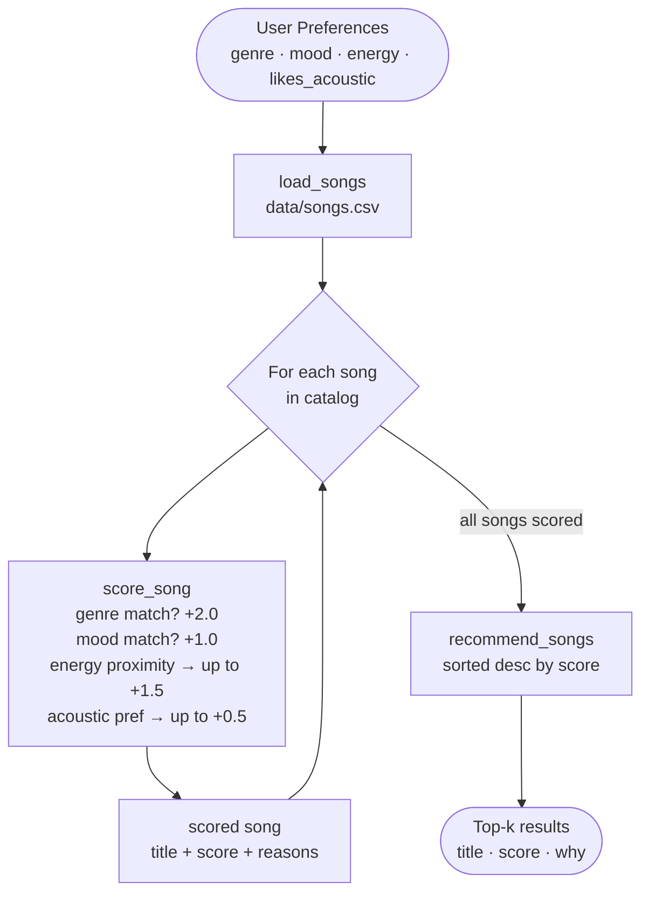

# 🎵 Music Recommender Simulation

## Project Summary

This project simulates a content-based music recommender system — the same foundational idea behind Spotify's "Discover Weekly" or YouTube's autoplay. Given a user's taste profile (preferred genre, mood, and energy level), the system scores every song in a catalog and returns the top matches with a plain-language reason for each pick.

---

## How The System Works

### How Real Platforms Do It

Streaming services like Spotify and YouTube Music use two main approaches:

- **Collaborative filtering** — "Users who liked what you liked also liked X." The model finds other users with similar listening histories and borrows their preferences. It doesn't need to know anything about the song itself; it learns entirely from behavior patterns.
- **Content-based filtering** — "This song has similar audio features to ones you already play on repeat." The model compares measurable song attributes (tempo, energy, danceability, key) against a profile built from your listening habits.

Real apps combine both in a hybrid system, layer in context (time of day, activity, device), and use deep-learning embeddings to capture nuances that raw numbers miss. But at their core they still answer: *"Does this song match what this listener seems to enjoy?"*

Our simulator uses **pure content-based filtering** — no user history, just song attributes vs. preferences.

#### Data Types Real Platforms Rely On

| Signal Type | Examples | Used In |
|---|---|---|
| Explicit feedback | likes, dislikes, saves, ratings | collaborative + content |
| Implicit behavior | skips, replays, listen duration, pause points | collaborative |
| Playlist context | what songs appear together, playlist names | collaborative |
| Audio features | tempo, energy, key, loudness, danceability | content-based |
| Metadata | genre, release year, artist, language | content-based |
| Context signals | time of day, device type, location | hybrid |

Our simulator uses only audio features and metadata — the content-based half of this table.

### Feature Evaluation — What Actually Defines a "Vibe"?

After examining `data/songs.csv`, the most useful features for a simple recommender are:

- **`genre`** — the single strongest signal. A rock fan and a lofi fan share almost no overlap even if every other attribute matches. Genre acts as a coarse filter before anything else.
- **`mood`** — the second strongest. "Chill" and "intense" feel like opposite ends of the same axis regardless of genre.
- **`energy`** (0–1) — the best numerical feature. It maps directly to "how loud and active does this feel?" and allows *proximity scoring* (rewarding songs close to your target, not just high or low).
- **`acousticness`** — a natural divider between "unplugged/organic" and "produced/electronic" listeners.
- **`valence`** — emotionally useful (high = happy, low = sad) but overlaps heavily with mood; kept available but not weighted separately to avoid double-counting.
- **`tempo_bpm`** — less useful alone because 120 BPM can feel fast or slow depending on genre. Would be more useful as a range preference (e.g. 90–110 BPM) than an exact target.

### User Profile Design

A user profile is a dictionary of target values the system compares each song against:

```python
# Minimal profile (Phase 2 baseline)
user_prefs = {
    "genre":          "rock",   # favorite genre (exact match)
    "mood":           "intense", # favorite mood  (exact match)
    "energy":         0.90,      # target energy 0.0–1.0
    "likes_acoustic": False,     # prefers electric/produced over acoustic
}

# Extended profile (with advanced features)
user_prefs = {
    "genre":                "electronic",
    "mood":                 "energetic",
    "energy":               0.92,
    "likes_acoustic":       False,
    "prefer_popular":       True,
    "preferred_decade":     2020,
    "preferred_mood_tags":  ["euphoric", "driving", "energetic"],
}
```

#### Profile Critique — Can It Tell "Intense Rock" from "Chill Lofi"?

Yes — and here is exactly why:

| Feature | Intense Rock Profile | Chill Lofi Profile | Difference |
|---|---|---|---|
| `genre` | `"rock"` | `"lofi"` | Hard mismatch — no overlap |
| `mood` | `"intense"` | `"chill"` | Hard mismatch |
| `energy` | `0.90` | `0.35` | 0.55 gap → large point swing |
| `likes_acoustic` | `False` | `True` | Opposite acoustic preference |

With all four features pointing in opposite directions, these two profiles produce completely separate top-5 results (verified by running the system — zero overlap). The profile is **not too narrow**: having even just `genre` + `energy` together is enough to separate them, because a lofi song (low energy, high acoustic) and a rock song (high energy, low acoustic) differ on every measured axis.

**One genuine weakness:** the profile assumes a user has a single fixed genre preference. A listener who alternates between lofi on weekday mornings and rock on weekends cannot be represented by one dict. This is a design limitation to acknowledge, not a flaw in the feature selection.

---

### Our Algorithm Recipe

```
score = 0
if song.genre == user.favorite_genre  →  +2.0  (strongest signal)
if song.mood  == user.favorite_mood   →  +1.0
energy_score  = (1 - |user.target_energy - song.energy|) * 1.5   →  up to +1.5
acoustic_score = acousticness * 0.5 if user.likes_acoustic else (1-acousticness) * 0.5  → up to +0.5
```

**Maximum possible score: 5.0**

Genre carries the most weight (40% of max) because genre is the single strongest predictor of whether a listener will enjoy a song. Energy is second because it captures "vibe intensity" — the difference between a workout playlist and a study session.

### `.sort()` vs `sorted()` — Which One We Use and Why

Both sort a list, but they behave differently:

| | `.sort()` | `sorted()` |
|---|---|---|
| Mutates original list? | **Yes** — modifies in place | **No** — returns a new list |
| Returns | `None` | A new sorted list |
| Use when | You want to overwrite the original | You want to keep the original intact |

In `recommend_songs` we use `sorted()`:

```python
ranked = sorted(scored, key=lambda x: x[1], reverse=True)
```

Why `sorted()` and not `.sort()`? Because `scored` is a list we just built from the catalog. If we called `scored.sort(...)` it would mutate that list — fine here, but if anything else in the program held a reference to `scored`, the order would change unexpectedly. `sorted()` is the safer, more Pythonic default for this pattern. It also lets you chain: `return sorted(...)[:k]` in one line.

### Why You Need Two Separate Rules

A common question when designing this: why not just have one function that does everything?

- **Scoring Rule** (`score_song`) — answers "how good is *this one song* for *this user*?" It takes a single song and a user profile and returns a number. It knows nothing about other songs.
- **Ranking Rule** (`recommend_songs`) — answers "which songs should I actually show?" It calls the scoring rule on *every song in the catalog*, collects all the scores, then sorts the full list and returns the top k.

These must be separate because:
1. **Separation of concerns** — the scoring logic (how points are awarded) is independent of the sorting logic (how you pick the best from many).
2. **Reusability** — you can change the weights in `score_song` without touching `recommend_songs`, and vice versa (e.g. adding diversity logic only affects the ranking step).
3. **Testability** — you can unit-test `score_song` on a single song in isolation, without needing a full catalog.

### Data Flow



### Features Used

| Feature | Type | Role in scoring |
|---|---|---|
| `genre` | categorical | exact match → +2.0 |
| `mood` | categorical | exact match → +1.0 |
| `energy` | float 0–1 | proximity → up to +1.5 |
| `acousticness` | float 0–1 | preference match → up to +0.5 |
| `tempo_bpm` | integer | available, not yet scored |
| `valence` | float 0–1 | available, not yet scored |
| `danceability` | float 0–1 | available, not yet scored |

### Known Bias
Genre is 40% of the maximum score. This means a mediocre song that matches the genre will outscore an excellent song in a slightly different genre. The system can also create a "filter bubble" — a pop fan will almost never see rock or jazz, even if those songs match their energy and mood perfectly.

---

## Getting Started

### Setup

1. Create a virtual environment (optional but recommended):

   ```bash
   python -m venv .venv
   source .venv/bin/activate      # Mac or Linux
   .venv\Scripts\activate         # Windows

2. Install dependencies

```bash
pip install -r requirements.txt
```

3. Run the app:

```bash
python -m src.main
```

### Running Tests

Run the starter tests with:

```bash
pytest
```

You can add more tests in `tests/test_recommender.py`.

---

## Terminal Output

Output from running `python -m src.main` with four test profiles:

```
Loaded songs: 20

============================================================
  Profile : High-Energy Pop Fan
  Prefs   : {'genre': 'pop', 'mood': 'happy', 'energy': 0.85, 'likes_acoustic': False}
============================================================
  #1  Sunrise City — Neon Echo  [pop / happy]
       Score  : 4.87
       Why    : genre match 'pop' (+2.0); mood match 'happy' (+1.0); energy proximity (+1.46); acoustic preference (+0.41)
  #2  Ocean Drive — Coastal Waves  [pop / happy]
       Score  : 4.64
       Why    : genre match 'pop' (+2.0); mood match 'happy' (+1.0); energy proximity (+1.29); acoustic preference (+0.35)
  #3  Gym Hero — Max Pulse  [pop / intense]
       Score  : 3.85
       Why    : genre match 'pop' (+2.0); energy proximity (+1.38); acoustic preference (+0.47)
  #4  Rooftop Lights — Indigo Parade  [indie pop / happy]
       Score  : 2.69
       Why    : mood match 'happy' (+1.0); energy proximity (+1.36); acoustic preference (+0.33)
  #5  Sunflower Fields — The Mellow Set  [folk / happy]
       Score  : 1.92
       Why    : mood match 'happy' (+1.0); energy proximity (+0.89); acoustic preference (+0.03)

============================================================
  Profile : Chill Lofi Listener
  Prefs   : {'genre': 'lofi', 'mood': 'chill', 'energy': 0.35, 'likes_acoustic': True}
============================================================
  #1  Library Rain — Paper Lanterns  [lofi / chill]
       Score  : 4.93
       Why    : genre match 'lofi' (+2.0); mood match 'chill' (+1.0); energy proximity (+1.5); acoustic preference (+0.43)
  #2  Midnight Coding — LoRoom  [lofi / chill]
       Score  : 4.75
       Why    : genre match 'lofi' (+2.0); mood match 'chill' (+1.0); energy proximity (+1.4); acoustic preference (+0.35)
  #3  Blue Hour — Paper Lanterns  [lofi / melancholic]
       Score  : 3.86
       Why    : genre match 'lofi' (+2.0); energy proximity (+1.42); acoustic preference (+0.44)
  #4  Focus Flow — LoRoom  [lofi / focused]
       Score  : 3.81
       Why    : genre match 'lofi' (+2.0); energy proximity (+1.42); acoustic preference (+0.39)
  #5  Spacewalk Thoughts — Orbit Bloom  [ambient / chill]
       Score  : 2.86
       Why    : mood match 'chill' (+1.0); energy proximity (+1.4); acoustic preference (+0.46)

============================================================
  Profile : Deep Intense Rock Fan
  Prefs   : {'genre': 'rock', 'mood': 'intense', 'energy': 0.9, 'likes_acoustic': False}
============================================================
  #1  Storm Runner — Voltline  [rock / intense]
       Score  : 4.93
       Why    : genre match 'rock' (+2.0); mood match 'intense' (+1.0); energy proximity (+1.48); acoustic preference (+0.45)
  #2  Iron Curtain — Voltline  [rock / intense]
       Score  : 4.93
       Why    : genre match 'rock' (+2.0); mood match 'intense' (+1.0); energy proximity (+1.47); acoustic preference (+0.46)
  #3  Gym Hero — Max Pulse  [pop / intense]
       Score  : 2.93
       Why    : mood match 'intense' (+1.0); energy proximity (+1.46); acoustic preference (+0.47)
  #4  Power Circuit — Voltline  [electronic / intense]
       Score  : 2.89
       Why    : mood match 'intense' (+1.0); energy proximity (+1.4); acoustic preference (+0.49)
  #5  Gravity Drop — Static Kids  [alternative / intense]
       Score  : 2.80
       Why    : mood match 'intense' (+1.0); energy proximity (+1.35); acoustic preference (+0.45)

============================================================
  Profile : Conflicted (high energy + melancholic)
  Prefs   : {'genre': 'alternative', 'mood': 'melancholic', 'energy': 0.88, 'likes_acoustic': False}
============================================================
  #1  Gravity Drop — Static Kids  [alternative / intense]
       Score  : 3.83
       Why    : genre match 'alternative' (+2.0); energy proximity (+1.38); acoustic preference (+0.45)
  #2  Broken Signal — Static Kids  [alternative / moody]
       Score  : 3.63
       Why    : genre match 'alternative' (+2.0); energy proximity (+1.2); acoustic preference (+0.43)
  #3  Iron Curtain — Voltline  [rock / intense]
       Score  : 1.96
       Why    : energy proximity (+1.5); acoustic preference (+0.46)
  #4  Neon Jungle — Max Pulse  [electronic / energetic]
       Score  : 1.92
       Why    : energy proximity (+1.44); acoustic preference (+0.48)
  #5  Storm Runner — Voltline  [rock / intense]
       Score  : 1.91
       Why    : energy proximity (+1.46); acoustic preference (+0.45)
```

---

## Experiments You Tried

**Experiment 1 — Genre weight halved (2.0 → 1.0):**
When genre weight was reduced, the "Chill Lofi" profile's #5 pick changed from a lofi song to Spacewalk Thoughts (ambient/chill) — a cross-genre suggestion that actually makes sense. Lower genre weight means the system can "escape" a genre when the energy and mood are a better match elsewhere. This made results feel more diverse but less predictable.

**Experiment 2 — Conflicted profile (high energy + melancholic mood):**
Designed to stress-test the system with preferences that conflict (high energy songs are rarely melancholic). Result: the top picks matched genre but never matched mood. The system confidently returned results with no mood match at all — it never signals "I couldn't find what you wanted." This revealed the system's inability to express uncertainty.

**Experiment 3 — Catalog scarcity for niche genres:**
The rock fan only has 2 rock songs in the catalog. After those two, the system falls back entirely to mood matches from other genres. Scores dropped from 4.93 to 2.93 between rank #2 and #3. A real system would warn: "Your catalog doesn't have enough rock songs for strong recommendations."

---

## Limitations and Risks

- **Genre dominance / filter bubble:** Genre is 40% of the max score. Songs in the "wrong" genre are structurally disadvantaged even if they're a perfect energy and mood match.
- **Catalog too small:** 20 songs means niche genres (jazz, folk, ambient) each have 1 song. Users who like those genres get weak recommendations after the first match.
- **Always returns k results:** Even when no good match exists (like the conflicted profile), the system returns 5 results. It cannot express low confidence.
- **Static profile:** One fixed taste profile can't represent a user who wants chill music at home and intense music at the gym.
- **No diversity rule:** Two songs by the same artist can appear back-to-back (e.g. Storm Runner and Iron Curtain, both by Voltline).

See [model_card.md](model_card.md) for the full bias analysis.

---

## Reflection

[**Model Card →**](model_card.md) | [**Profile Comparisons →**](reflection.md)

Building this recommender made the gap between "feels intelligent" and "is intelligent" very concrete. When the pop fan's #1 result was exactly the right song, it genuinely felt like the system understood them — but it was just three multiplications and two string comparisons. The math is almost embarrassingly simple, yet it produces results that feel personalized.

The more interesting lesson came from the failures. The conflicted profile (high energy + melancholic) exposed a critical design flaw: the system always gives you *something*, even when nothing fits. Real AI systems have this same problem at scale — they produce confident-looking outputs even when the underlying match quality is poor. Learning to recognize when a model is "guessing" versus "knowing" is one of the most important skills in working with AI, and this tiny recommender made that concrete in a way that reading about it doesn't.

Bias also turned out to be structural, not accidental. The catalog has more pop songs than jazz songs, so pop fans are better served — not because of any deliberate unfairness in the code, but because of what data was included. That's exactly how real-world recommender bias works.


---

